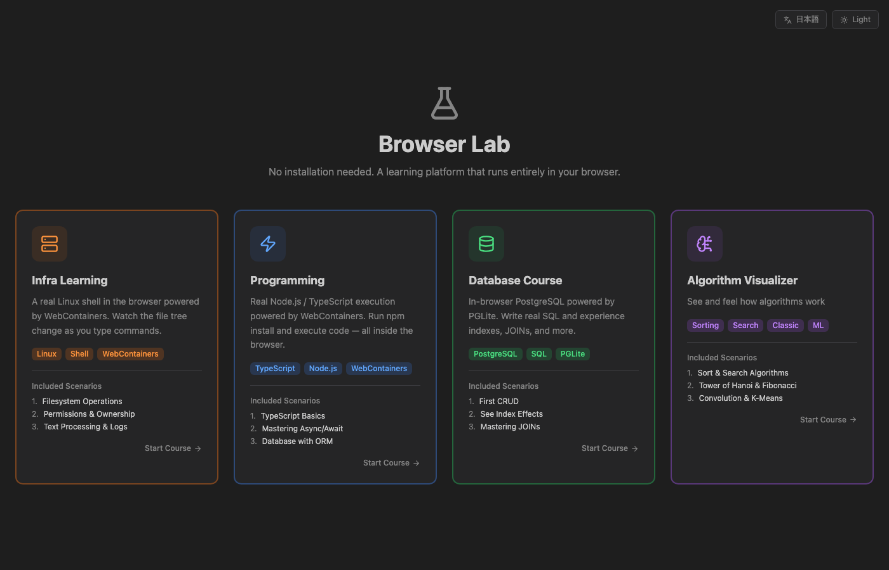
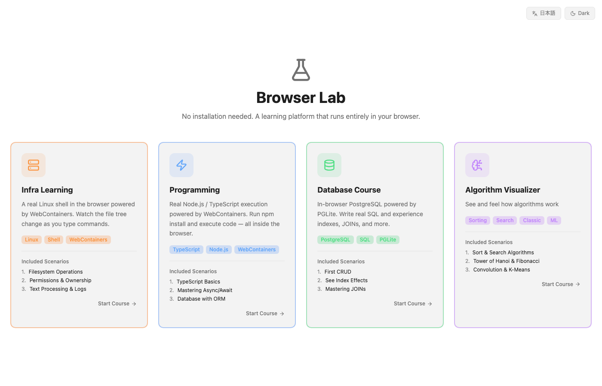
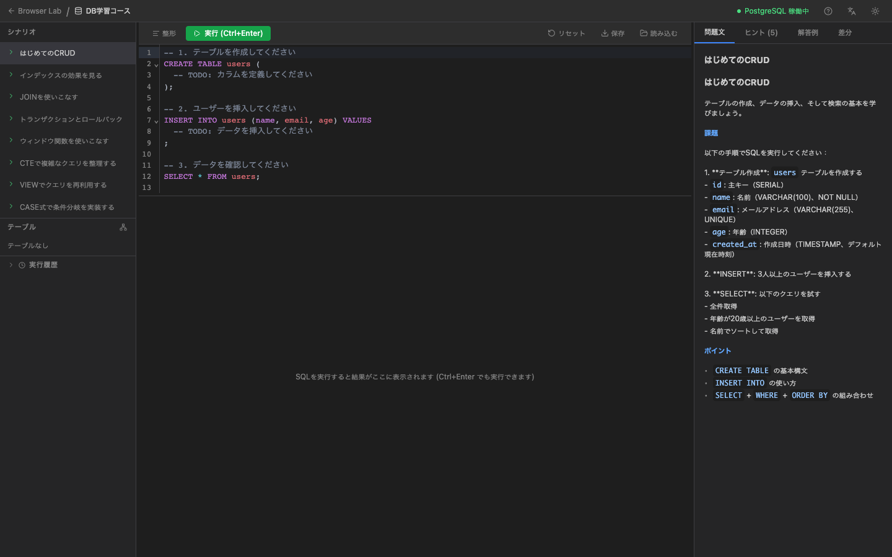
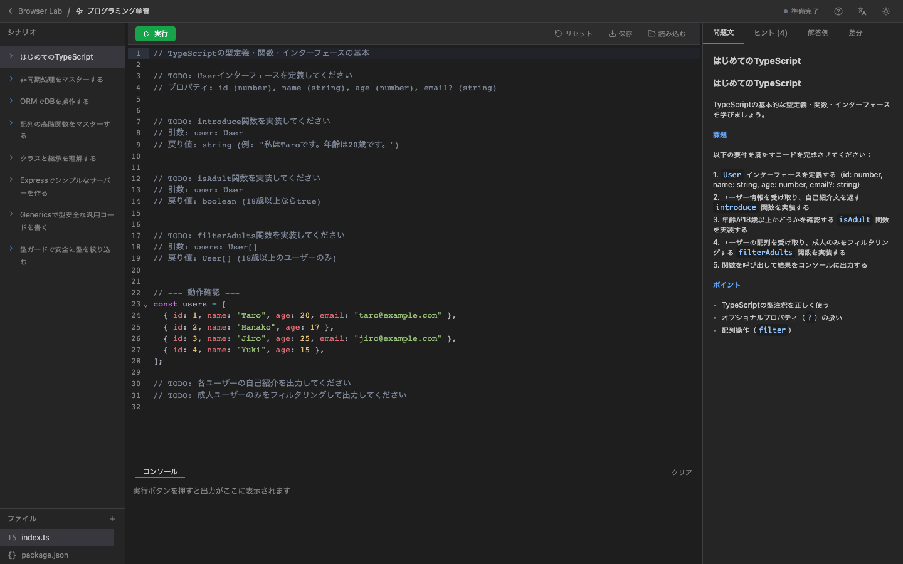

# Browser Lab 🧪

ブラウザだけで動く、インストール不要の学習プラットフォームです。

- **プログラミング学習コース** — WebContainers を使ったブラウザ内 Node.js / TypeScript 実行環境
- **DB 学習コース** — PGLite を使ったブラウザ内 PostgreSQL 操作・SQL 学習環境

## デモ

**https://anbuttersand0206.github.io/browser-lab/**

## スクリーンショット

### トップページ

<p>
  
  
</p>

### DB 学習コース — SQL エディタ・シナリオパネル・テーブルツリー



### プログラミング学習コース — コードエディタ・コンソール・シナリオパネル



## 技術スタック

| 役割 | ライブラリ |
|------|-----------|
| フロントエンド | Vite + React + TypeScript |
| ルーティング | React Router (HashRouter) |
| コードエディタ | CodeMirror 6 |
| ブラウザ内 Node.js | WebContainers API |
| ブラウザ内 PostgreSQL | PGLite (@electric-sql/pglite) |
| スタイリング | Tailwind CSS |
| アイコン | Lucide React |
| COOP/COEP 対応 + PWA キャッシュ | カスタム Service Worker (public/sw.js) |

## ローカル開発

詳細は [documents/local_dev_setup.md](documents/local_dev_setup.md) を参照してください。

```bash
npm install
npm run dev
```

開発サーバーは COOP/COEP ヘッダーを自動で付与するため、追加設定なしで WebContainers が動作します。

## ビルド

```bash
npm run build
```

## GitHub Pages へのデプロイ

`.github/workflows/deploy.yml` に設定済みです。`main` ブランチへの push で自動デプロイされます。

事前に GitHub リポジトリの **Settings → Pages → Source** を **"GitHub Actions"** に変更してください。

## 機能

### データの保存・読み込み

ブラウザを閉じると作業内容は**失われます**（バックエンドなしのため）。

各コースのツールバーにある「保存」ボタンで JSON ファイルとしてエクスポートできます。
「読み込む」ボタンで保存した JSON を読み込んで作業を再開できます。

### 離脱警告

- コードや SQL を編集した状態でページを閉じようとすると、ブラウザ標準の確認ダイアログが表示されます
- 注意：ブラウザ仕様上、確認ダイアログのメッセージはブラウザが固定文言を表示します（カスタム文言は無視されます）
- 別のシナリオへの移動時はアプリ内のモーダルで確認を求めます

### ダーク / ライトモード

システム設定に追従しつつ、右上のボタンで手動切り替えも可能です。

## 学習シナリオ

### プログラミング学習コース

1. **はじめてのTypeScript** — 型定義・関数・インターフェースの基本
2. **非同期処理をマスターする** — async/await と Promise の扱い方
3. **ORMでDBを操作する** — Kysely を使ったブラウザ内 PostgreSQL CRUD 実装

### DB 学習コース

1. **はじめてのCRUD** — テーブル作成 → INSERT → SELECT の基本
2. **インデックスの効果を見る** — EXPLAIN ANALYZE で実行計画を比較
3. **JOINを使いこなす** — 複数テーブルの結合・集計クエリ

## PWA としてインストールする

Chrome / Edge のアドレスバー右端に表示される「インストール」ボタンをクリックすると、
デスクトップアプリとして登録できます。

> **初回アクセス時の挙動について**
> GitHub Pages では Service Worker (`sw.js`) が COOP/COEP ヘッダーを付与します。
> 初回ロード時は SW のインストールが完了した後に自動リロードが入ります（2回ロードされます）。
> 2回目以降は通常通り起動します。

## TODO

GitHub Pages で動作するフロントエンド完結の範囲で検討中の改善・追加機能です。

### シナリオ拡充

- [ ] プログラミング学習コース — シナリオ追加（例: クラス・継承、配列高階関数、エラーハンドリング）
- [ ] DB 学習コース — シナリオ追加（例: トランザクション・ロールバック、ウィンドウ関数、サブクエリ）

### エディタ・UX

- [ ] CodeMirror の自動補完（TypeScript 型情報、SQL キーワード）を強化する
- [ ] キーボードショートカット一覧をヘルプパネルに表示する

### DB コース固有

- [ ] `EXPLAIN ANALYZE` の結果をツリー表示など、より見やすい形式でレンダリングする
- [ ] テーブルツリーでカラム定義（型・制約）をツールチップ表示する

### アクセシビリティ・品質

- [ ] キーボードのみで全操作できるよう `aria-*` 属性・フォーカス管理を整備する
- [ ] Lighthouse スコアを測定し、Performance / Accessibility 項目を改善する

## ライセンス

MIT
