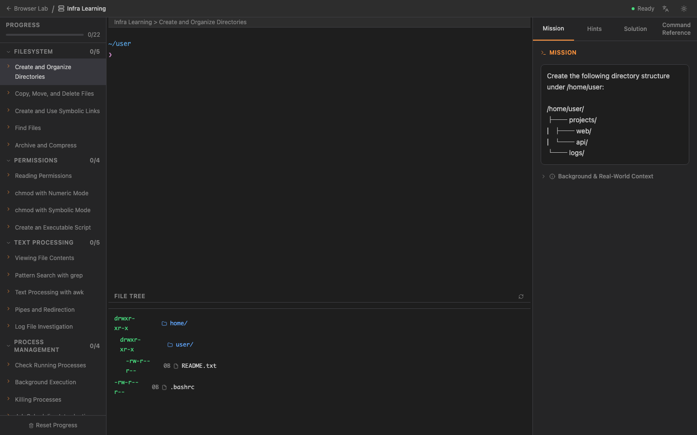
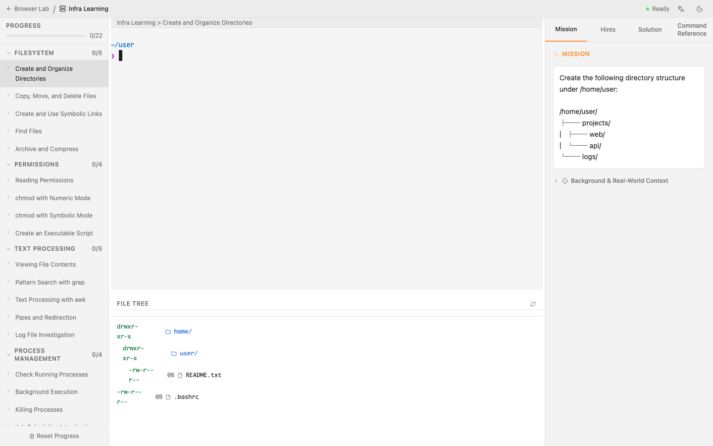
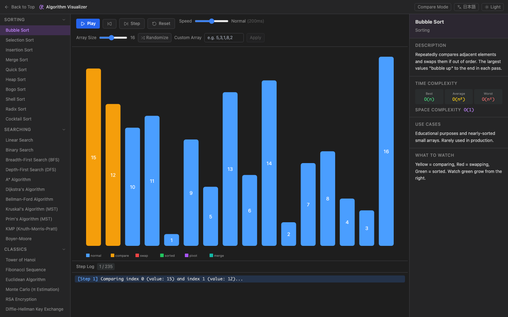
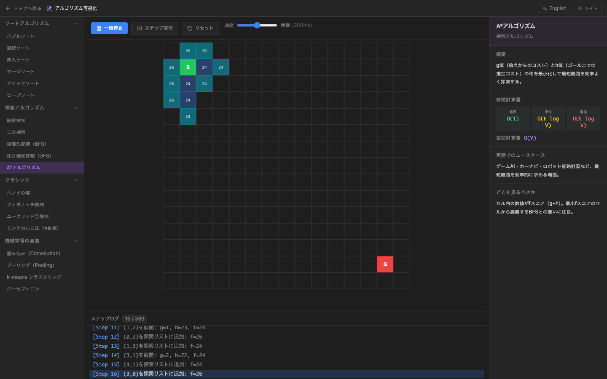
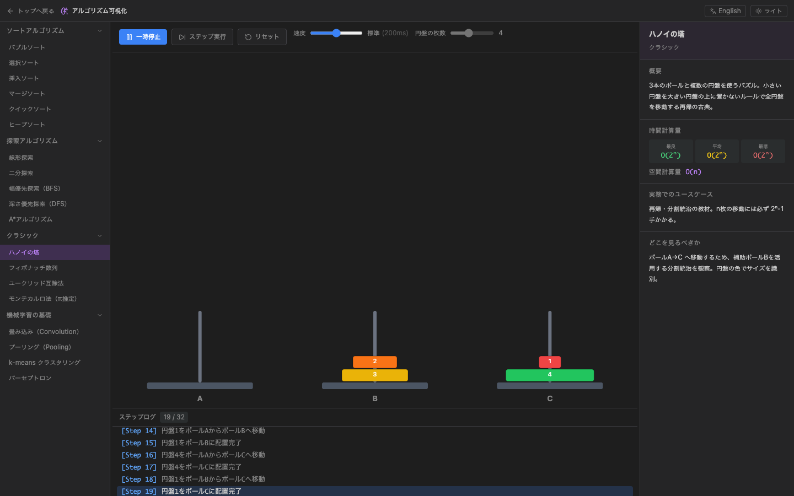

# Browser Lab 🧪

ブラウザだけで動く、インストール不要の学習プラットフォームです。

- **プログラミング学習コース** — WebContainers を使ったブラウザ内 Node.js / TypeScript 実行環境
- **DB 学習コース** — PGLite を使ったブラウザ内 PostgreSQL 操作・SQL 学習環境
- **アルゴリズム可視化コース** — 37 種のアルゴリズムをステップ実行・速度調整しながら視覚的に学べる環境
- **インフラ学習コース** — WebContainers を使ったブラウザ内 Linux ターミナル操作・システム管理学習環境

## デモ

**https://anbuttersand0206.github.io/browser-lab/**

## スクリーンショット

### トップページ

<p>
  
  
</p>

### インフラ学習コース — ターミナル・ミッションパネル・ファイルツリー

<p>
  
  
</p>

### アルゴリズム可視化コース — バブルソート（スワップ中）



### アルゴリズム可視化コース — A\* アルゴリズム（グリッド探索）



### アルゴリズム可視化コース — ハノイの塔（円盤移動）



### DB 学習コース — SQL エディタ・シナリオパネル・テーブルツリー


### プログラミング学習コース — コードエディタ・コンソール・シナリオパネル


## 技術スタック

| 役割 | ライブラリ |
|------|-----------|
| フロントエンド | Vite + React + TypeScript |
| ルーティング | React Router (HashRouter) |
| コードエディタ | CodeMirror 6 |
| ブラウザ内 Node.js | WebContainers API |
| ブラウザ内 PostgreSQL | PGLite (@electric-sql/pglite) |
| スタイリング | Tailwind CSS |
| アイコン | Lucide React |
| アルゴリズム可視化 | SVG / Canvas（ライブラリ不使用） |
| COOP/COEP 対応 + PWA キャッシュ | カスタム Service Worker (public/sw.js) |

## ローカル開発

詳細は [documents/local_dev_setup.md](documents/local_dev_setup.md) を参照してください。

```bash
npm install
npm run dev
```

開発サーバーは COOP/COEP ヘッダーを自動で付与するため、追加設定なしで WebContainers が動作します。

## ビルド

```bash
npm run build
```

## GitHub Pages へのデプロイ

`.github/workflows/deploy.yml` に設定済みです。`main` ブランチへの push で自動デプロイされます。

事前に GitHub リポジトリの **Settings → Pages → Source** を **"GitHub Actions"** に変更してください。

## 機能

### アルゴリズム可視化コース

37 種のアルゴリズムをステップ実行・速度調整しながら視覚的に学べます。

| カテゴリ | アルゴリズム |
|----------|-------------|
| ソート | バブル・選択・挿入・マージ・クイック・ヒープ・ボゴ・シェル・ラディックス・カクテル |
| 探索 | 線形・二分探索、BFS・DFS・A\*、ダイクストラ・ベルマンフォード、クラスカル・プリム、KMP・ボイヤームーア |
| クラシック | ハノイの塔、フィボナッチ数列、ユークリッド互除法、モンテカルロ法、RSA暗号、ディフィー・ヘルマン、ナップサック、レーベンシュタイン距離、迷路生成 |
| 機械学習の基礎 | 畳み込み（CNN）、プーリング、k-means クラスタリング、パーセプトロン、SVM、PCA、決定木 |

- **再生 / 一時停止 / ステップ実行 / リセット** — 自分のペースで追える
- **速度スライダー（5 段階）** — スローモーションから高速再生まで
- **ステップログ** — 各ステップで何が起きているかをテキストで説明
- **右パネル** — 時間計算量・空間計算量・ユースケース・可視化の読み方を表示
- **グリッド編集**（BFS / DFS / A\*）— 壁・スタート・ゴールをクリックで自由に配置
- **日本語 / 英語** 切り替え対応

### インフラ学習コース

WebContainers を活用し、ブラウザ上で本物の Linux ターミナルを操作しながらインフラの基礎を学べます。

- **xterm.js による本格ターミナル** — コピー＆ペースト、リサイズ、インタラクティブなコマンド実行に対応
- **リアルタイム・ファイルツリー** — コマンド操作によるファイルシステムの変更を視覚的に追跡
- **ミッション判定システム** — ディレクトリ構造・ファイル内容・権限設定・コマンド出力を自動チェックしてクリア判定
- **ミッション進捗の保存** — クリア済みミッションを localStorage に保存し、リロード後も進捗が維持される
- **ヒント・解答機能** — 詰まった時のためのステップバイステップなガイドと解答を段階開示

### データの保存・読み込み

ブラウザを閉じると作業内容は**失われます**（バックエンドなしのため）。

各コースのツールバーにある「保存」ボタンで JSON ファイルとしてエクスポートできます。
「読み込む」ボタンで保存した JSON を読み込んで作業を再開できます。

### 離脱警告

- コードや SQL を編集した状態でページを閉じようとすると、ブラウザ標準の確認ダイアログが表示されます
- 注意：ブラウザ仕様上、確認ダイアログのメッセージはブラウザが固定文言を表示します（カスタム文言は無視されます）
- 別のシナリオへの移動時はアプリ内のモーダルで確認を求めます

### ダーク / ライトモード

システム設定に追従しつつ、右上のボタンで手動切り替えも可能です。

### 日本語 / 英語 切り替え

右上の言語ボタンで全コースの UI を切り替えられます。ブラウザのロケールに合わせて初期言語を自動判定します。

## 学習シナリオ

### プログラミング学習コース

1. **はじめてのTypeScript** — 型定義・関数・インターフェースの基本
2. **非同期処理をマスターする** — async/await と Promise の扱い方
3. **ORMでDBを操作する** — Kysely を使ったブラウザ内 PostgreSQL CRUD 実装

### DB 学習コース

1. **はじめてのCRUD** — テーブル作成 → INSERT → SELECT の基本
2. **インデックスの効果を見る** — EXPLAIN ANALYZE で実行計画を比較
3. **JOINを使いこなす** — 複数テーブルの結合・集計クエリ

### アルゴリズム可視化コース

左サイドバーから 37 種のアルゴリズムを選択して可視化を開始できます。
右パネルの解説を読みながらステップ実行すると、アルゴリズムの「気持ち」がわかります。

### インフラ学習コース

1. **ファイルシステム** — mkdir, cp, mv, rm, ln, find, tar 等の操作（全 5 ミッション）
2. **パーミッション** — chmod（数値・記号表記）によるアクセス権管理、実行可能スクリプトの作成（全 4 ミッション）
3. **テキスト処理** — head/tail, grep, awk、パイプ・リダイレクトを使ったログ解析（全 5 ミッション）
4. **プロセス管理** — ps, jobs, kill, cron によるプロセスとジョブ制御（全 4 ミッション）
5. **シェルスクリプト** — 変数・環境変数、条件分岐、ループ、実用スクリプト作成（全 4 ミッション）

## PWA としてインストールする

Chrome / Edge のアドレスバー右端に表示される「インストール」ボタンをクリックすると、
デスクトップアプリとして登録できます。

> **初回アクセス時の挙動について**
> GitHub Pages では Service Worker (`sw.js`) が COOP/COEP ヘッダーを付与します。
> 初回ロード時は SW のインストールが完了した後に自動リロードが入ります（2回ロードされます）。
> 2回目以降は通常通り起動します。

## TODO

GitHub Pages で動作するフロントエンド完結の範囲で検討中の改善・追加機能です。

### 機能拡張

- [ ] **自動保存機能** — `IndexedDB` を使用して、編集中のコードや SQL をブラウザに自動保存
- [ ] **URL での共有機能** — 編集中のコードや SQL を URL（ハッシュ）に圧縮して含め、他のユーザーと共有できる機能
- [ ] **カスタムシナリオの読み込み** — 外部の JSON ファイルから独自の学習シナリオを読み込める機能
- [ ] **プログラミングコース: テスト実行** — Vitest 等を組み込み、課題がクリアされたか自動判定する機能
- [ ] **DBコース: スキーマビジュアライザー** — ER 図のようにテーブル定義を視覚化する機能
- [ ] **DBコース: 実行履歴** — 過去に実行した SQL クエリの履歴を保存・再利用できる機能
- [ ] **DBコース: 結果のエクスポート** — クエリ結果を CSV や JSON でダウンロードできる機能
- [ ] **アルゴリズムコース: 前ステップ戻り** — ステップバックボタンで 1 ステップ戻れる機能
- [ ] **アルゴリズムコース: カスタム入力** — 任意の配列・グリッドをテキストで直接入力できる機能
- [ ] **アルゴリズムコース: 比較モード** — 2 つのアルゴリズムを同時に動かして速度や挙動を比較する機能
- [ ] **インフラコース: シェルスクリプト判定** — `.sh` ファイルの実行結果や内容を自動判定するミッションの追加
- [ ] **インフラコース: ネットワークシミュレーション** — `curl` 等を使った擬似的なネットワークトラブルシューティング
- [ ] **インフラコース: プロセス管理ビジュアライザー** — 実行中のプロセスをツリー形式で可視化・操作できる機能
- [ ] **インフラコース: Vim 練習モード** — ターミナル内エディタの基本操作（モード切替、保存等）のインタラクティブガイド

### UX / パフォーマンス

- [ ] **レスポンシブ対応の強化** — モバイル・タブレット端末でのレイアウト最適化
- [ ] **チュートリアルモード** — 初回訪問者向けに各機能の使い方を案内するツアー機能
- [ ] **テーマの追加** — シンタックスハイライトに Dracula や Solarized などのバリエーションを追加
- [ ] **アセットのオフライン対応** — PWA としてより強固に動作させるための Service Worker 改善

### 学習コンテンツ

- [ ] **プログラミングコース: シナリオ拡充** — React/Vite を使った UI 開発シナリオなど
- [ ] **DBコース: シナリオ拡充** — トランザクション、ビュー、ウィンドウ関数などの高度な SQL
- [ ] **アルゴリズムコース: シナリオ拡充** — グラフアルゴリズム（ダイクストラ・ベルマンフォード）、動的計画法など

## ライセンス

MIT
